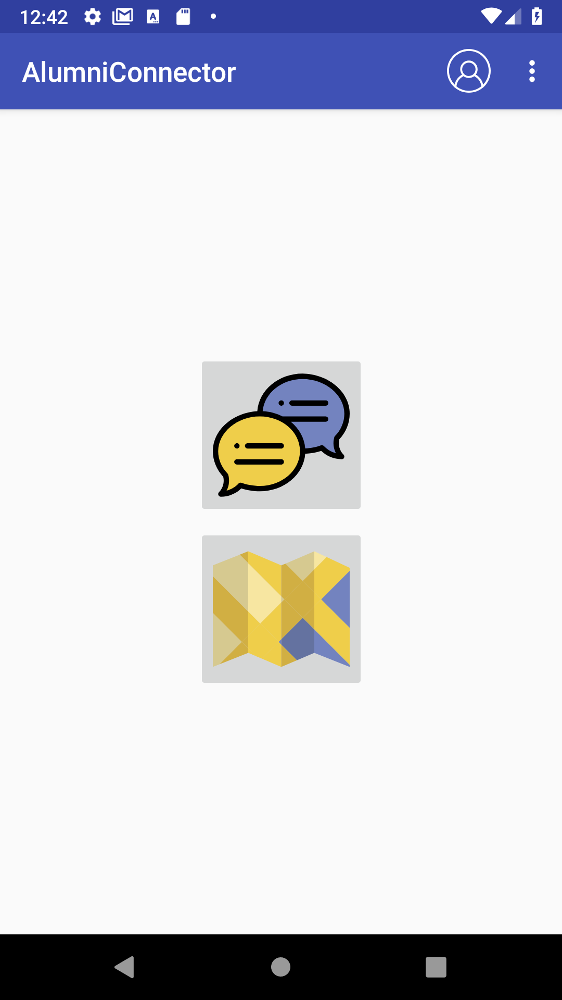
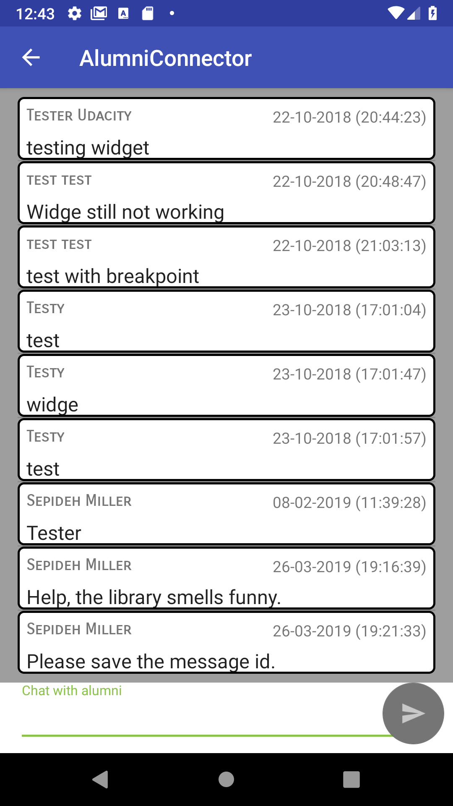
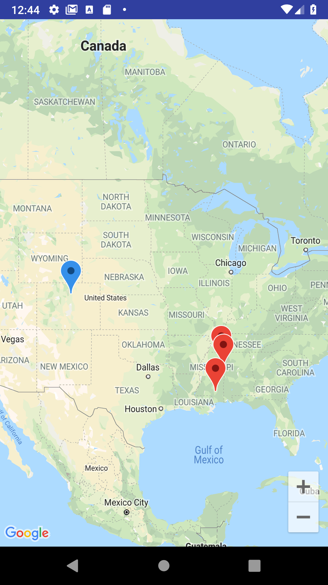

# Alumni Connector
Alumni Connector is the capstone project for the Android Nanogree program. The proposal for this project can be found in [Capstone_Stage1.pdf](Capstone_Stage1.pdf).

The login functionality of this app and the ChatActivity will not work without the google-services.json file. The map will not work without a google_maps_api.xml file. 

This is an App for the alumni of the Mississippi School for Mathematics and Science. The school has existed since 1990. A lot of the alumni live in Mississippi, though there are alumni all over the US now. Very few alumni live in other countries. The app will be expanded to work for alumni outside of the US eventually. 
However, the way I have worded my API query to Mapquest does not allow for locations in other countries to be queried yet.  

I need more information on addresses in other countries to make it work. Do other countries have states or state equivalents as part of their addresses? Do I need a new state field that is not a spinner but just a text field for places outside of the US? 

In this project, I am using ButterKnife for the first time and Firebase database and authorization for the first time. 

## SelectorActivity
This activity allows a user to update their profile or log out from the menu. It allows a user to chat or view the map from the buttons.

## ChatActivity
This activity allows a user to send chat messages to be seen by all of the alumni.

## MapActivity
This activity allows a user to see a map with pins marking all of the alumni. The blue pin represents the user's own address.

## Attributions
Thanks to Nhor Phai for [the icon](https://www.flaticon.com/free-icon/plug_1104875) for the log in screen.

Thanks to SmashIcons for the [map icon](https://www.flaticon.com/free-icon/map_148844) for the selection screen.

Thanks to Freepik for the [chat icon](https://www.flaticon.com/free-icon/speech-bubble_1077909) for the selection screen.

Thanks to Nice and Serious for the [profile icon](https://www.flaticon.com/free-icon/avatar-inside-a-circle_78373) for the selection screen.
